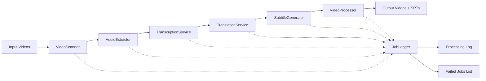
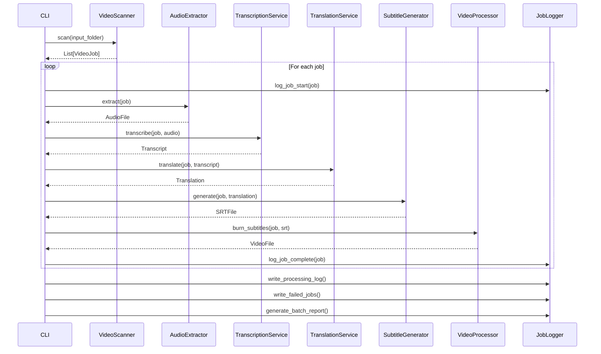

# Design Document: Batch Mandarin to Indonesian Subtitle Pipeline

## Overview

The Batch Subtitle Pipeline is a command-line tool that automates the processing of Mandarin video content to produce Indonesian-subtitled videos. The system orchestrates audio extraction, speech transcription, text translation, subtitle file generation, and subtitle burning into a cohesive batch processing workflow.

**Core Capabilities:**
- Batch processing of multiple .mp4 video files
- Mandarin audio transcription using Whisper/faster-whisper
- Mandarin-to-Indonesian translation
- SRT subtitle file generation
- Subtitle burning into video output
- Comprehensive logging and error handling
- Resume capability for failed jobs

**Design Goals:**
- **Simplicity**: POC targets 10 videos with straightforward sequential processing
- **Scalability**: Architecture supports growth to 1,000-10,000 videos via concurrency
- **Replaceability**: Transcription and translation providers are pluggable
- **Observability**: Detailed logs, job tracking, and batch reports
- **Resilience**: Individual job failures don't halt the entire batch

## Architecture

The system follows a pipeline architecture with distinct stages, each responsible for a specific transformation. Data flows linearly through the stages, with each stage consuming the output of the previous stage.



**Architectural Principles:**
- **Stage Independence**: Each stage is a separate component with clear input/output contracts
- **Provider Abstraction**: Transcription and translation use interfaces for provider swapping
- **Fail-Fast Per Job**: Job failures are isolated; the batch continues
- **Intermediate Preservation**: Audio, transcripts, and SRTs are retained for debugging
- **Stateless Processing**: Each job is independent; no shared mutable state between jobs

## Folder Structure

```
project_root/
├── input/                    # Source video files
│   ├── video1.mp4
│   ├── video2.mp4
│   └── ...
├── output/                   # Final outputs
│   ├── video1_subtitled.mp4
│   ├── video1.srt
│   ├── video2_subtitled.mp4
│   ├── video2.srt
│   ├── processing.log
│   ├── failed_jobs.txt
│   └── batch_report.json
├── temp/                     # Intermediate files (cleared on success)
│   ├── video1_audio.wav
│   ├── video1_transcript.json
│   ├── video1_translation.json
│   └── ...
└── config.yaml               # Configuration file
```

**Directory Responsibilities:**
- `input/`: Read-only source of .mp4 files
- `output/`: Final artifacts (videos with burned subtitles, SRT files, logs, reports)
- `temp/`: Transient storage for intermediate processing artifacts
- Root: Configuration and orchestration scripts

## Components and Interfaces

### VideoScanner

**Responsibility:** Discover and validate input video files.

**Interface:**
```python
class VideoScanner:
    def scan(input_folder: Path) -> List[VideoJob]:
        """
        Scans input folder for .mp4 files and creates job entries.
        Returns list of validated jobs with status PENDING.
        """
```

**Behavior:**
- Recursively scans input folder for .mp4 files
- Validates each file (readable, has audio track via FFprobe)
- Creates `VideoJob` object for each valid video
- Skips and logs invalid files

---

### AudioExtractor

**Responsibility:** Extract audio tracks from video files.

**Interface:**
```python
class AudioExtractor:
    def extract(job: VideoJob) -> AudioFile:
        """
        Extracts audio from video using FFmpeg.
        Returns AudioFile with path to WAV/MP3 in temp folder.
        Raises ExtractionError on failure.
        """
```

**Behavior:**
- Uses FFmpeg to extract audio: `ffmpeg -i input.mp4 -vn -acodec pcm_s16le output.wav`
- Saves audio to `temp/{video_name}_audio.wav`
- Verifies audio file is non-empty and readable
- Updates job status to AUDIO_EXTRACTED

---

### TranscriptionService

**Responsibility:** Transcribe Mandarin audio to timestamped text segments.

**Interface:**
```python
class TranscriptionProvider(ABC):
    @abstractmethod
    def transcribe(audio_file: AudioFile, language: str) -> Transcript:
        """Returns Transcript with timestamped segments."""

class WhisperProvider(TranscriptionProvider):
    """OpenAI Whisper implementation"""
    
class FasterWhisperProvider(TranscriptionProvider):
    """faster-whisper implementation"""

class TranscriptionService:
    def __init__(self, provider: TranscriptionProvider):
        self.provider = provider
    
    def transcribe(job: VideoJob, audio: AudioFile) -> Transcript:
        """
        Transcribes audio using configured provider.
        Returns Transcript with segments (start_time, end_time, text).
        Raises TranscriptionError on failure.
        """
```

**Behavior:**
- Delegates to configured provider (Whisper or faster-whisper)
- Detects language as Mandarin/Chinese (configurable or auto-detect)
- Returns timestamped segments with 500ms or better timing accuracy
- Saves transcript JSON to `temp/{video_name}_transcript.json`
- Updates job status to TRANSCRIBED

---

### TranslationService

**Responsibility:** Translate Mandarin text segments to Indonesian.

**Interface:**
```python
class TranslationProvider(ABC):
    @abstractmethod
    def translate(segments: List[TextSegment], source_lang: str, target_lang: str) -> List[TextSegment]:
        """Translates segments preserving timestamps."""

class GoogleTranslateProvider(TranslationProvider):
    """Google Translate API implementation"""

class DeepLProvider(TranslationProvider):
    """DeepL API implementation"""

class TranslationService:
    def __init__(self, provider: TranslationProvider):
        self.provider = provider
    
    def translate(job: VideoJob, transcript: Transcript) -> Translation:
        """
        Translates Mandarin segments to Indonesian.
        Returns Translation with same timing, translated text.
        Raises TranslationError on failure.
        """
```

**Behavior:**
- Delegates to configured provider (Google Translate, DeepL, etc.)
- Translates each segment independently (preserves segment boundaries)
- Maintains original start_time and end_time for each segment
- Saves translation JSON to `temp/{video_name}_translation.json`
- Updates job status to TRANSLATED

---

### SubtitleGenerator

**Responsibility:** Create SRT subtitle files from translated segments.

**Interface:**
```python
class SubtitleGenerator:
    def generate(job: VideoJob, translation: Translation) -> SRTFile:
        """
        Generates SRT file from translated segments.
        Returns SRTFile with path to .srt in output folder.
        Raises SubtitleError on failure.
        """
```

**Behavior:**
- Formats each segment as SRT entry: sequence number, timestamp, text, blank line
- Timestamp format: `HH:MM:SS,mmm --> HH:MM:SS,mmm`
- Saves SRT to `output/{video_name}.srt`
- Validates SRT format correctness
- Updates job status to SRT_GENERATED

**SRT Format Example:**
```
1
00:00:01,000 --> 00:00:03,500
Halo, selamat datang.

2
00:00:04,000 --> 00:00:07,200
Ini adalah video drama pendek.
```

---

### VideoProcessor

**Responsibility:** Burn subtitles into video output.

**Interface:**
```python
class VideoProcessor:
    def burn_subtitles(job: VideoJob, srt_file: SRTFile) -> VideoFile:
        """
        Burns SRT subtitles into video using FFmpeg.
        Returns VideoFile with path to output video.
        Raises VideoProcessingError on failure.
        """
```

**Behavior:**
- Uses FFmpeg to burn subtitles: `ffmpeg -i input.mp4 -vf "subtitles=subtitle.srt" output.mp4`
- Preserves original video quality, resolution, codec, audio track
- Subtitle placement: bottom center (configurable font, size, position)
- Saves output to `output/{video_name}_subtitled.mp4`
- Verifies output video is playable (non-zero size, valid container)
- Updates job status to COMPLETED

---

### JobLogger

**Responsibility:** Record processing events and generate reports.

**Interface:**
```python
class JobLogger:
    def log_job_start(job: VideoJob):
        """Logs job start with timestamp and filename."""
    
    def log_job_complete(job: VideoJob):
        """Logs successful completion with outputs."""
    
    def log_job_failure(job: VideoJob, error: Exception):
        """Logs failure with error details and stack trace."""
    
    def write_processing_log(log_file: Path):
        """Writes all log entries to processing.log."""
    
    def write_failed_jobs(failed_file: Path):
        """Writes failed job list to failed_jobs.txt."""
    
    def generate_batch_report(report_file: Path, jobs: List[VideoJob]):
        """Generates JSON batch report with summary statistics."""
```

**Behavior:**
- Maintains in-memory log buffer during batch processing
- Writes structured logs to `output/processing.log`
- Creates `output/failed_jobs.txt` with failed job names and error messages
- Generates `output/batch_report.json` with counts, timing, success rate

---

### RetryManager

**Responsibility:** Handle job resumption and retry logic.

**Interface:**
```python
class RetryManager:
    def load_job_state(state_file: Path) -> List[VideoJob]:
        """Loads previously saved job state from JSON."""
    
    def save_job_state(state_file: Path, jobs: List[VideoJob]):
        """Saves current job states to JSON for resume."""
    
    def filter_resumable(jobs: List[VideoJob]) -> List[VideoJob]:
        """Returns jobs that are incomplete or failed."""
```

**Behavior:**
- Saves job state to `output/job_state.json` after each job
- Allows resuming from last saved state (skip completed jobs)
- Supports retry of failed jobs from last successful stage
- POC: Manual resume (re-run with `--resume` flag)
- Future: Automatic retry with exponential backoff

---

### CLI Runner

**Responsibility:** Orchestrate the entire pipeline from command-line invocation.

**Interface:**
```python
class PipelineRunner:
    def run(input_folder: Path, output_folder: Path, config: Config):
        """
        Executes the full batch processing pipeline.
        Returns batch summary with success/failure counts.
        """
```

**Command-Line Interface:**
```bash
python pipeline.py --input ./input --output ./output [--config config.yaml] [--resume]
```

**CLI Arguments:**
- `--input`: Path to input folder (required)
- `--output`: Path to output folder (required)
- `--config`: Path to configuration file (optional, defaults to config.yaml)
- `--resume`: Resume from saved job state (optional)

**Behavior:**
- Validates input/output folders exist
- Loads configuration from file or defaults
- Scans input folder and creates jobs
- Processes jobs sequentially (POC) or concurrently (future)
- Displays progress: `Processing 3/10: video3.mp4 (30%)`
- Logs all events to console and file
- Prints final summary: success count, failure count, total time

## Data Models

### VideoJob

```python
@dataclass
class VideoJob:
    job_id: str                    # Unique identifier (UUID)
    video_path: Path               # Path to input .mp4
    video_name: str                # Filename without extension
    status: JobStatus              # Current processing status
    created_at: datetime
    updated_at: datetime
    error_message: Optional[str]   # Set if status is FAILED
    
    # Intermediate artifacts
    audio_path: Optional[Path]
    transcript_path: Optional[Path]
    translation_path: Optional[Path]
    srt_path: Optional[Path]
    output_video_path: Optional[Path]
```

### JobStatus

```python
class JobStatus(Enum):
    PENDING = "pending"
    AUDIO_EXTRACTED = "audio_extracted"
    TRANSCRIBED = "transcribed"
    TRANSLATED = "translated"
    SRT_GENERATED = "srt_generated"
    COMPLETED = "completed"
    FAILED = "failed"
```

### Transcript

```python
@dataclass
class TextSegment:
    start_time: float    # Seconds
    end_time: float      # Seconds
    text: str

@dataclass
class Transcript:
    segments: List[TextSegment]
    language: str
    source_audio: Path
```

### Translation

```python
@dataclass
class Translation:
    segments: List[TextSegment]  # Translated text, original timestamps
    source_language: str
    target_language: str
    source_transcript: Path
```

### Config

```python
@dataclass
class Config:
    # Provider selection
    transcription_provider: str   # "whisper" or "faster-whisper"
    translation_provider: str     # "google", "deepl", etc.
    
    # Processing options
    source_language: str = "zh"   # Mandarin
    target_language: str = "id"   # Indonesian
    concurrency_level: int = 1    # Number of parallel jobs (POC: 1)
    
    # FFmpeg options
    audio_codec: str = "pcm_s16le"
    audio_format: str = "wav"
    subtitle_font: str = "Arial"
    subtitle_fontsize: int = 24
    
    # Cleanup options
    cleanup_temp_on_success: bool = True
    cleanup_temp_on_failure: bool = False
```

## Data Flow



**Flow Description:**
1. CLI scans input folder for videos and creates jobs
2. For each job, execute pipeline stages sequentially
3. Each stage updates job status and saves intermediate artifacts
4. On failure, log error and continue to next job
5. After all jobs, write logs and reports

## Output Files

### Primary Outputs

1. **Subtitled Videos**: `{video_name}_subtitled.mp4`
   - Original video with burned-in Indonesian subtitles
   - Preserved quality and audio

2. **SRT Files**: `{video_name}.srt`
   - Indonesian subtitles in SubRip format
   - Reusable for other video players or editing

### Logging and Reports

3. **Processing Log**: `processing.log`
   - Timestamped entries for all processing events
   - Job start, completion, failures with stack traces

4. **Failed Jobs List**: `failed_jobs.txt`
   - Plain text list of failed video names and error reasons
   - Format: `video_name.mp4: Error message`

5. **Batch Report**: `batch_report.json`
   ```json
   {
     "batch_id": "uuid",
     "start_time": "2025-01-15T10:30:00Z",
     "end_time": "2025-01-15T11:45:00Z",
     "total_jobs": 10,
     "completed": 8,
     "failed": 2,
     "success_rate": 0.8,
     "total_duration_seconds": 4500,
     "failed_jobs": ["video3.mp4", "video7.mp4"]
   }
   ```

### Intermediate Files (Temporary)

6. **Audio Files**: `temp/{video_name}_audio.wav`
   - Extracted audio track
   - Preserved on failure for debugging

7. **Transcript JSON**: `temp/{video_name}_transcript.json`
   ```json
   {
     "language": "zh",
     "segments": [
       {"start": 0.5, "end": 3.2, "text": "你好，欢迎观看"},
       {"start": 3.5, "end": 7.8, "text": "这是一部短剧"}
     ]
   }
   ```

8. **Translation JSON**: `temp/{video_name}_translation.json`
   ```json
   {
     "source_language": "zh",
     "target_language": "id",
     "segments": [
       {"start": 0.5, "end": 3.2, "text": "Halo, selamat menonton"},
       {"start": 3.5, "end": 7.8, "text": "Ini adalah drama pendek"}
     ]
   }
   ```

9. **Job State**: `output/job_state.json`
   - Current status of all jobs for resume capability

## Error Handling

### Error Categories

1. **Validation Errors** (Pre-processing)
   - Missing input folder
   - No .mp4 files found
   - Invalid configuration
   - **Action**: Exit immediately with error message

2. **Job-Level Errors** (During processing)
   - Audio extraction failure (corrupt video, no audio track)
   - Transcription failure (API error, unsupported format)
   - Translation failure (API rate limit, network timeout)
   - Subtitle generation failure (invalid timestamp format)
   - Video processing failure (FFmpeg error, disk full)
   - **Action**: Mark job as FAILED, log error, continue to next job

3. **System Errors** (Infrastructure)
   - Disk space exhausted
   - Insufficient memory
   - Missing dependencies (FFmpeg, Whisper)
   - **Action**: Log error, attempt graceful shutdown, save job state

### Error Recovery Strategy

**Job Isolation:**
- Each job is independent; failure doesn't affect other jobs
- Failed jobs are logged and skipped
- Batch continues until all jobs are attempted

**Intermediate File Preservation:**
- On job failure, preserve temp files for debugging
- Allows manual inspection of audio, transcript, translation
- Supports manual retry from last successful stage

**Resume Capability:**
- Job state saved after each job completion
- Re-running with `--resume` skips completed jobs
- Failed jobs can be retried after fixing root cause

**Logging and Alerting:**
- All errors logged with full stack traces
- Failed jobs list provides quick summary
- Batch report shows overall health

**Example Error Log Entry:**
```
[2025-01-15 10:45:23] ERROR: Job video3.mp4 failed at TRANSCRIPTION stage
Exception: TranscriptionError: Whisper API rate limit exceeded (429)
Stack trace: ...
Temp files preserved: temp/video3_audio.wav
```

## Resume and Skip Strategy

### Resume Mechanism

The pipeline supports resuming from a previous run to avoid re-processing completed jobs.

**State Persistence:**
- After each job, save current state to `output/job_state.json`
- State includes: job_id, video_name, status, timestamps, artifact paths

**Resume Flow:**
1. CLI invoked with `--resume` flag
2. Load job state from `job_state.json`
3. Filter out jobs with status COMPLETED
4. Re-attempt jobs with status FAILED or incomplete
5. Continue from last successful stage for each job

**Partial Job Resume (Future Enhancement):**
- Currently: Failed jobs restart from beginning
- Future: Resume from last successful stage (e.g., skip audio extraction if transcript exists)
- Requires validation of intermediate artifacts before reuse

### Skip Strategy

The pipeline automatically skips invalid or problematic files during scanning.

**Skip Conditions:**
- File is not .mp4 format
- File is unreadable (permissions, corruption)
- File has no audio track (verified with FFprobe)
- File size is zero

**Skip Behavior:**
- Log skip reason: `[WARN] Skipping video_corrupt.mp4: No audio track detected`
- Exclude from job list
- Include in final summary: `Scanned: 12 files, Valid: 10, Skipped: 2`

**Manual Skip (Future Enhancement):**
- Support `.skiplist` file with video names to exclude
- Useful for selectively processing subset of input folder

## Scalability Notes

### POC: 10 Videos (Sequential Processing)

**Characteristics:**
- Single-threaded sequential processing
- Simple implementation, easy to debug
- Estimated time: 5-10 minutes per video = 50-100 minutes total
- Minimal resource usage

**Implementation:**
```python
for job in jobs:
    try:
        process_job(job)
    except Exception as e:
        log_failure(job, e)
```

### Scale to 1,000 Videos (Concurrent Processing)

**Approach: Thread Pool or Process Pool**
- Use Python `concurrent.futures.ThreadPoolExecutor` or `ProcessPoolExecutor`
- Concurrency level: 4-8 jobs (based on CPU cores and API rate limits)
- Estimated time: 1,000 videos / 6 parallel = ~167 jobs × 7 minutes = ~20 hours

**Constraints:**
- API rate limits (Whisper, translation services)
- Disk I/O bottleneck (concurrent FFmpeg writes)
- Memory usage (multiple transcription models)

**Implementation:**
```python
with ThreadPoolExecutor(max_workers=6) as executor:
    futures = [executor.submit(process_job, job) for job in jobs]
    for future in as_completed(futures):
        result = future.result()
```

### Scale to 10,000 Videos (Distributed Processing)

**Approach: Message Queue + Worker Pool**
- Use task queue (Celery, RQ, AWS SQS)
- Distribute jobs across multiple worker machines
- Centralized job state in database (PostgreSQL, Redis)
- Estimated time: 10,000 videos / 50 parallel workers = ~200 jobs × 7 minutes = ~24 hours

**Architecture Changes:**
- Replace in-memory job list with database
- Replace file-based state with Redis/PostgreSQL
- Implement worker nodes that poll queue for jobs
- Centralize output storage (S3, shared NFS)

**Additional Considerations:**
- **API Rate Limits**: Implement backoff and retry logic
- **Cost Optimization**: Use batch transcription APIs where available
- **Monitoring**: Add metrics (Prometheus, CloudWatch) for job throughput
- **Fault Tolerance**: Worker crashes should not lose jobs (queue persistence)

**Future Enhancements:**
- Horizontal scaling with Kubernetes or ECS
- Adaptive concurrency based on resource availability
- Priority queue for urgent jobs

## Provider Interfaces and Replaceability

### Transcription Providers

**Interface Contract:**
```python
class TranscriptionProvider(ABC):
    @abstractmethod
    def transcribe(self, audio_file: Path, language: str) -> Transcript:
        """
        Transcribes audio to timestamped text segments.
        
        Args:
            audio_file: Path to WAV or MP3 audio
            language: ISO 639-1 language code (e.g., "zh")
        
        Returns:
            Transcript with segments (start, end, text)
        
        Raises:
            TranscriptionError: On failure
        """
```

**Implementations:**

1. **WhisperProvider** (OpenAI Whisper)
   - Uses `openai-whisper` library
   - Runs locally (CPU or GPU)
   - No API costs, slower

2. **FasterWhisperProvider** (faster-whisper)
   - Uses `faster-whisper` library (CTranslate2 backend)
   - Runs locally, significantly faster
   - Recommended for POC

3. **OpenAIAPIProvider** (Future)
   - Uses OpenAI Whisper API
   - Cloud-based, requires API key
   - Fast, usage-based pricing

**Configuration:**
```yaml
transcription:
  provider: "faster-whisper"
  model: "base"  # tiny, base, small, medium, large
  device: "cpu"  # cpu or cuda
```

### Translation Providers

**Interface Contract:**
```python
class TranslationProvider(ABC):
    @abstractmethod
    def translate(self, segments: List[TextSegment], source_lang: str, target_lang: str) -> List[TextSegment]:
        """
        Translates text segments preserving timestamps.
        
        Args:
            segments: List of text segments with start, end, text
            source_lang: Source language code (e.g., "zh")
            target_lang: Target language code (e.g., "id")
        
        Returns:
            Translated segments with same start/end times
        
        Raises:
            TranslationError: On failure
        """
```

**Implementations:**

1. **GoogleTranslateProvider**
   - Uses `googletrans` library or Google Cloud Translation API
   - Free tier available
   - Good quality for Indonesian

2. **DeepLProvider**
   - Uses DeepL API
   - Higher quality, limited language support
   - Check if Indonesian is supported

3. **AzureTranslatorProvider** (Future)
   - Microsoft Azure Translator
   - Enterprise-grade, usage-based pricing

**Configuration:**
```yaml
translation:
  provider: "google"
  api_key: "YOUR_API_KEY"  # If using paid API
  batch_size: 50  # Translate N segments per API call
```

## POC Implementation Strategy

### Phase 1: Core Pipeline (Week 1)

**Goal:** End-to-end pipeline for 1 video

**Components:**
1. VideoScanner (basic file listing)
2. AudioExtractor (FFmpeg wrapper)
3. TranscriptionService (faster-whisper)
4. TranslationService (googletrans free tier)
5. SubtitleGenerator (SRT formatter)
6. VideoProcessor (FFmpeg subtitle burning)

**Deliverable:** Process 1 video from input to subtitled output

**Validation:**
- Play output video, verify subtitles are visible and synchronized
- Inspect SRT file for correct format
- Check logs for complete processing trace

### Phase 2: Batch Processing (Week 2)

**Goal:** Process 10 videos with error handling and logging

**Additions:**
1. JobLogger (file logging, batch reports)
2. Error handling (try-catch per job)
3. Job state tracking (VideoJob model)
4. CLI interface (argparse)

**Deliverable:** Process 10 videos in batch, generate reports

**Validation:**
- All 10 videos processed (with expected failures logged)
- processing.log contains all events
- failed_jobs.txt lists failed jobs
- batch_report.json shows summary statistics

### Phase 3: Resume and Configuration (Week 3)

**Goal:** Add resume capability and configurable providers

**Additions:**
1. RetryManager (job state persistence)
2. Config file support (YAML)
3. Provider abstraction (TranscriptionProvider, TranslationProvider interfaces)
4. CLI `--resume` flag

**Deliverable:** Resume interrupted batches, switch providers via config

**Validation:**
- Interrupt batch mid-run, resume skips completed jobs
- Change transcription provider in config, pipeline adapts
- Change translation provider, pipeline adapts

### Phase 4: Testing and Documentation (Week 4)

**Goal:** Validate correctness and prepare for production use

**Activities:**
1. Unit tests for core components
2. Integration tests for full pipeline
3. Performance testing (measure throughput)
4. Documentation (README, configuration guide)

**Deliverable:** Tested, documented POC ready for 1,000+ video scale

**Validation:**
- All tests pass
- Documentation covers setup, usage, troubleshooting
- Performance baseline established (videos/hour)

## Testing Strategy

Property-based testing is not applicable to this feature because the system is primarily composed of:
- Infrastructure orchestration (FFmpeg, external transcription/translation services)
- Side-effect operations (file I/O, subprocess execution)
- External API integration with rate limits and costs

The system does not contain algorithmic transformations or pure functions with universal properties that would benefit from randomized input generation over 100+ iterations.

### Unit Testing Approach

**Test Coverage:**
- Component isolation with mocked dependencies
- Focus on business logic and error handling
- Verify correct interface usage

**Key Test Cases:**

**VideoScanner:**
- Valid .mp4 files are discovered
- Invalid/corrupt files are skipped
- Files without audio are skipped
- Empty folder returns empty job list

**AudioExtractor:**
- Successful extraction produces valid WAV file
- FFmpeg errors are caught and raised as ExtractionError
- Output path follows naming convention

**SubtitleGenerator:**
- Valid segments produce correctly formatted SRT
- Timestamp format is HH:MM:SS,mmm
- Sequence numbers are sequential starting from 1
- Empty segment list produces empty SRT

**JobLogger:**
- Log entries are timestamped correctly
- Failed jobs are captured in failed_jobs.txt
- Batch report contains correct counts

**RetryManager:**
- Completed jobs are filtered out on resume
- Failed jobs are included in resumable list
- Job state round-trips through JSON serialization

### Integration Testing Approach

**Test Coverage:**
- End-to-end pipeline with real sample videos
- Verify output quality and correctness
- Test error handling with problematic inputs

**Key Test Scenarios:**

**Happy Path:**
- Process 3 sample videos (short, 10-30 seconds each)
- Verify all outputs exist (subtitled video, SRT, logs)
- Verify subtitles are synchronized (manual inspection)
- Verify batch report shows 3/3 success

**Error Handling:**
- Process corrupt video file → marked as failed, logged
- Process video without audio → skipped during scanning
- Simulate transcription API failure → job fails, temp files preserved
- Simulate translation API failure → job fails, logged

**Resume Capability:**
- Start batch of 5 videos
- Interrupt after 2 complete
- Resume with --resume flag
- Verify only 3 remaining videos are processed
- Verify final batch report shows all 5

**Provider Switching:**
- Process video with Whisper provider
- Change config to faster-whisper
- Process same video again
- Verify both produce valid outputs

### Contract Testing Approach

**Test Coverage:**
- Verify all provider implementations conform to abstract interfaces
- Test provider replaceability without breaking pipeline

**TranscriptionProvider Contract Tests:**
```python
def test_transcription_provider_contract(provider: TranscriptionProvider):
    # Given a valid audio file
    audio_file = Path("test_audio.wav")
    
    # When transcribe is called
    transcript = provider.transcribe(audio_file, language="zh")
    
    # Then transcript has required structure
    assert transcript.segments is not None
    assert len(transcript.segments) > 0
    assert all(seg.start_time < seg.end_time for seg in transcript.segments)
    assert all(len(seg.text) > 0 for seg in transcript.segments)
```

**TranslationProvider Contract Tests:**
```python
def test_translation_provider_contract(provider: TranslationProvider):
    # Given valid text segments
    segments = [TextSegment(0.0, 2.0, "你好")]
    
    # When translate is called
    translated = provider.translate(segments, source_lang="zh", target_lang="id")
    
    # Then translation preserves structure
    assert len(translated) == len(segments)
    assert translated[0].start_time == segments[0].start_time
    assert translated[0].end_time == segments[0].end_time
    assert translated[0].text != segments[0].text  # Text changed
```

### Performance Testing Approach

**Test Coverage:**
- Measure throughput (videos/hour)
- Identify bottlenecks
- Validate scalability assumptions

**Benchmarks:**

**Single Video Processing Time:**
- Extract audio: ~5-10 seconds
- Transcribe (faster-whisper, base model): ~30-120 seconds
- Translate: ~5-20 seconds
- Generate SRT: <1 second
- Burn subtitles: ~20-60 seconds
- **Total: ~60-210 seconds per video**

**Batch Processing (10 videos, sequential):**
- Expected: 10-35 minutes total
- Measured: [TBD during testing]

**Scalability Validation:**
- Process 10 videos sequentially (baseline)
- Process 10 videos with concurrency=4
- Measure speedup, identify bottlenecks
- Validate resource usage (CPU, memory, disk)

**Load Testing (Future):**
- Simulate 1,000 video batch
- Monitor API rate limits
- Test resume capability under load

### Test Data Requirements

**Sample Videos:**
- 3 short videos (10-30 seconds) with Mandarin audio for happy path testing
- 1 video without audio track (skip test)
- 1 corrupt/unreadable video file (error handling test)

**Mock Providers:**
- FakeTranscriptionProvider: Returns deterministic transcript for testing
- FakeTranslationProvider: Returns deterministic translation for testing
- Allows testing without external API dependencies

**Test Fixtures:**
- Pre-generated transcript JSON
- Pre-generated translation JSON
- Pre-generated SRT files
- Expected batch reports

**CI/CD Integration:**
- Unit tests run on every commit (fast, no external dependencies)
- Integration tests run on PR (with sample videos, real providers)
- Performance tests run weekly (baseline tracking)

